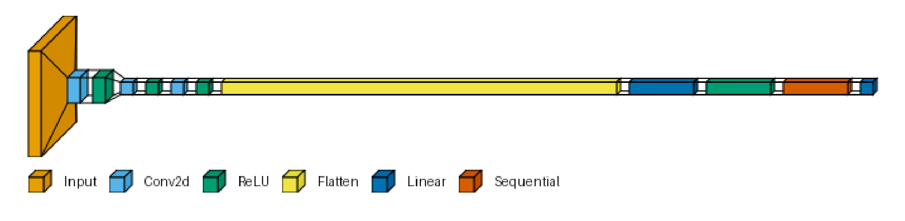
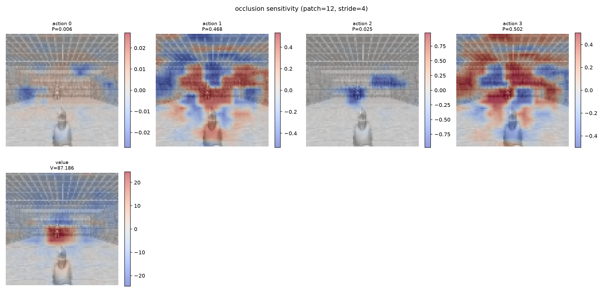
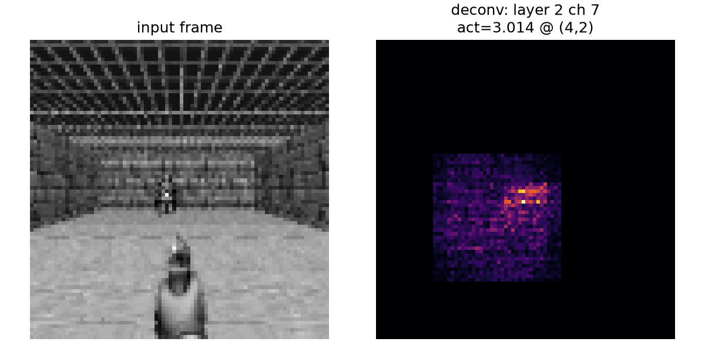
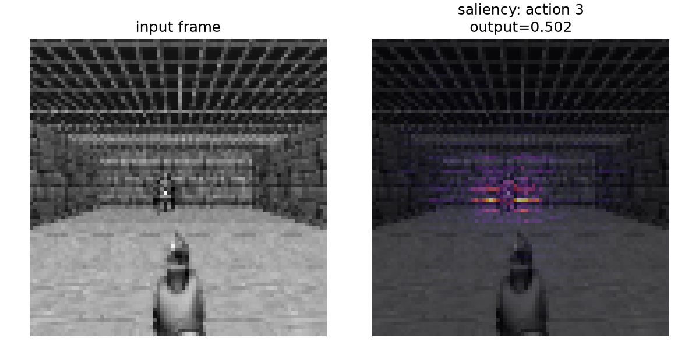
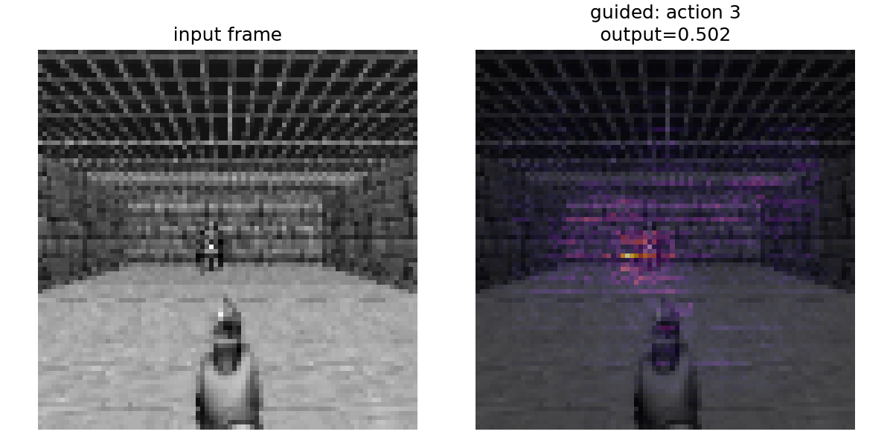

# vizdoom_clone_project_vibecoded

A neural network that plays DOOM, trained with reinforcement learning on top of [ViZDoom](https://github.com/Farama-Foundation/ViZDoom) — every single-player training scenario, plus full DOOM / DOOM II game levels.

## Approach

The agent is a CNN policy trained with **PPO** (via `stable-baselines3`) directly on preprocessed screen pixels — there is no LLM in the control loop. That was a deliberate choice: ViZDoom makes a decision roughly every 30ms, which is far faster than any local LLM can generate, and a text-only model can't see the screen without adding even more latency. A future phase may add an LLM as a *high-level* planner (issuing directives like `EXPLORE` / `RETREAT` every second or two) sitting on top of this policy, but that only makes sense once the low-level controller already works — so this repo focuses on that first.

## Status

All 12 single-player scenarios and full-game levels are **implemented**; training progress varies per scenario:

- **Trained and performing well:** `basic` (single room, one monster), `deadly_corridor` (baseline run climbed `ep_rew_mean` from -88 to +151 over 950k steps; the reward-shaped version warm-started from it is the current default).
- **Implemented, training in progress / not yet run:** `defend_the_center`, `defend_the_line`, `health_gathering`, `health_gathering_supreme`, `my_way_home`, `predict_position`, `take_cover`, plus the basic variants `simpler_basic`, `rocket_basic`, and `basic_audio` (screen+sound observation — needs a working OpenAL device, untested).
- **Full DOOM / DOOM II levels:** any map (`E1M1`..`E4M9`, `MAP01`..`MAP32`) at any skill via `train_doom_level.py --map`. Works out of the box with the Freedoom WADs bundled with `vizdoom`; auto-detects a real `doom.wad`/`doom2.wad` dropped into `wads/` (see `wads/README.md`) if you own the games.

### Reward shaping

Most scenario `.cfg`s score only a sliver of what good play looks like (deadly_corridor: distance + death penalty; full game levels: literally just reaching the exit). Nine opt-in wrappers (`envs/common.py`) add denser signal on top of any scenario's built-in reward; each scenario's env module (`envs/*_env.py`) turns on the ones that match its objective:

| Bonus | What it rewards | Example defaults |
|---|---|---|
| `kill_reward_bonus` | Each `KILLCOUNT` increment | 20 (combat scenarios), 100 (`predict_position` — one shot/episode) |
| `hit_reward_bonus` | Each `HITCOUNT` increment (landing a shot, not just a kill) | 5, or 25 for `predict_position` |
| `exploration_bonus_per_cell` | First visit to each discretized position cell per episode | 1.0 (`deadly_corridor`, `my_way_home`, full levels) |
| `weapon_pickup_bonus` | First acquisition of each `WEAPON0`–`9` slot per episode | 15 (`deadly_corridor`, full levels) |
| `damage_dealt_bonus` | Each `DAMAGECOUNT` point (distinguishes solid hits from grazes) | off by default everywhere |
| `damage_taken_penalty` | Each `DAMAGE_TAKEN` point (subtracted) | 0.5 (`take_cover`) |
| `health_change_bonus` | Net `HEALTH` delta per step (medkits +, damage -) | 1.0 (`health_gathering*`, full levels) |
| `armor_change_bonus` | Net `ARMOR` delta per step | 0.5 (full levels) |
| `exploration_cell_size` | (knob, not a bonus) size of an exploration grid cell in map units | 32 ≈ one Doom grid tile |

Scenarios with sufficient built-in reward (`basic` and its variants) leave everything off. Every train script accepts the same override flags (`--kill-reward-bonus`, `--hit-reward-bonus`, `--exploration-bonus-per-cell`, `--exploration-cell-size`, `--weapon-pickup-bonus`, `--damage-dealt-bonus`, `--damage-taken-penalty`, `--health-change-bonus`, `--armor-change-bonus`), plus PPO stability guards `--ent-coef` / `--target-kl`.

### Policy architecture

Rendered via `visualize_PPO_model.py` from each scenario's actual saved `CnnPolicy` (not a diagram of the code) — NatureCNN feature extractor feeding into PPO's action head. The action count varies per scenario (4 for `basic`, 8 for `deadly_corridor`, 20 for full levels); the CNN trunk is the same. (`basic_audio` is the one exception to the pure-CNN setup — its policy is SB3's `MultiInputPolicy` over a screen+audio dict.)

**`basic.wad`:**


**`deadly_corridor.wad` (shaped reward):**



### CNN diagnostics — what is the policy actually looking at?

`visualize_PPO_model.py` draws the network's *shape*; `visualize_cnn_diagnostics.py` shows what it's *doing* — a Zeiler & Fergus (2014), ["Visualizing and Understanding Convolutional Networks"](https://cs.nyu.edu/~fergus/papers/zeilerECCV2014.pdf), style diagnostic toolkit adapted for this project's `NatureCNN` (three strided convs, no max-pooling — so the paper's "unpool" step doesn't apply here, there's nothing to invert) and for a PPO actor-critic (the paper's "class probability" becomes **action probability** and, separately, the critic's **value estimate**).

```powershell
# Zero dependencies beyond torch/matplotlib: fresh untrained network + a
# random frame, just to sanity-check shapes.
python visualize_cnn_diagnostics.py

# The real thing: a trained model, a live frame played out of the actual env.
python visualize_cnn_diagnostics.py --model models/latest/ppo_basic.zip --env basic

# Pick a technique, a conv layer (0/1/2), and scan many frames for a
# channel's top-k strongest activations (the paper's signature figure):
python visualize_cnn_diagnostics.py --model models/latest/ppo_basic.zip --env basic \
    --technique deconv --layer 1 --n-live-frames 40 --topk 9
```

| Technique | Paper section | What it shows | CLI flag |
|---|---|---|---|
| Deconvnet reconstruction | Sec 2.1, Sec 3 (Fig 2, Fig 4) | Picks one strong activation in one conv layer's feature map, zeros everything else there, and runs the conv stack in reverse (rectify → transposed-filter, per layer, no unpooling) back down to input-pixel space — the specific pattern that drove that unit. `--topk`/`--n-live-frames` scans many frames for a channel's strongest hits, the paper's top-9 grid. | `--technique deconv` |
| Occlusion sensitivity | Sec 4.2 (Fig 6) | Slides a gray patch over the frame and re-runs the whole grid in one batched pass, plotting the *drop* in each action's probability and in the value estimate at every position — red means "the model needed this region," blue means occluding it actually helped that output. | `--technique occlusion` |
| Saliency / guided backprop | Sec 3 (as a cheaper proxy) | Gradient of a chosen output (an action's probability, or the value estimate) w.r.t. input pixels. Guided backprop additionally zeros negative gradients at every ReLU on the way back (Springenberg et al. 2015), which is why its maps below are visibly sharper/less noisy than plain saliency. | `--technique saliency` / `--technique guided` |

All four, run against the real `ppo_basic.zip` model on a live frame from `envs/basic_env.py` — every technique independently converges on the same region (the monster), which is the correct thing for `basic.wad`'s "kill the one monster" objective:

**Occlusion sensitivity** (red = the model relies on this region for that output; note the value heatmap lighting up almost exactly on the monster):



**Deconvnet reconstruction** (layer 2, the channel with the strongest activation for this frame — auto-picked, since a fixed channel index is frequently dead/all-zero for a given input and that's a legitimate but uninteresting result):



**Saliency** vs. **guided backprop** (same frame, same target action — guided backprop's mask is visibly tighter):




Frame sources: `--frame path.npy` / `--frames path.npy` (single frame or a batch, `(n_stack, 84, 84)` or channel-last, values 0-255) for offline analysis, or `--env {basic,deadly_corridor}` to play the real scenario live and grab frames through the project's own `VecFrameStack` pipeline (so stacking order always matches training — nothing here reimplements it by hand). Outputs land in `--out-dir` (default `cnn_diagnostics_out/`, gitignored) as PNGs, alongside printed pixel-statistics for each heatmap/reconstruction so a degenerate (all-zero or uniform) result is obvious from the console output alone, not just the image.

**Verified in this project's `.venv`** against `models/latest/ppo_basic.zip` (`stable_baselines3` 2.9.0): `ActorCriticCnnPolicy` has `share_features_extractor=True` and `net_arch=[]` (both SB3 defaults for `CnnPolicy`), so `pi_features_extractor is vf_features_extractor`, and `mlp_extractor.policy_net` / `.value_net` are both empty `nn.Sequential()`s — i.e. `action_net` and `value_net` read directly off the same 512-d `NatureCNN` output with no hidden MLP in between. `visualize_cnn_diagnostics.py`'s `DiagnosticPolicy` wraps those real layers directly rather than approximating them.

## Setup

Requires a project-local virtual environment (do not use a global Python install for this).

```powershell
# Windows cmd
setup_env.bat
```
```bash
# Git Bash / WSL / any POSIX shell
./setup_env.sh
```

Both scripts resolve a Python 3.14 interpreter via the `py` launcher, create `.venv`, and `pip install -r requirements.txt` (which pins `torch==2.12.1+cu130` via `--extra-index-url`, plus `vizdoom`, `gymnasium`, `stable-baselines3`, `tensorboard`, `matplotlib`, and `visualtorch`) — re-runs skip the reinstall if `requirements.txt` hasn't changed since the last successful install. If both scripts break, fall back to manual setup:

```powershell
python -m venv .venv
.venv\Scripts\Activate.ps1
pip install -r requirements.txt
```

Installed and verified on this machine: Python 3.14.6, `vizdoom` 1.3.0, `gymnasium` 1.3.0, `torch` 2.12.1+cu130, `stable-baselines3` 2.9.0, on an AMD Ryzen 7 5800H (8 cores / 16 threads) with an NVIDIA RTX 3060 (6GB).

## Usage

### Desktop launcher (recommended)

A small Tkinter UI wraps everything below — pick any of the 14 levels, tweak reward-shaping values, and start/stop training or live-watching without touching the terminal:

```powershell
.venv\Scripts\python.exe train_ui.py
```

Beyond Start/Stop Training and Watch Agent:

- **Visualize Model** renders the selected level's saved policy architecture as a PNG and shows it inline next to the log.
- **Export Model** saves the selected level's current model to a file of your choosing — a normal SB3 `.zip` with scenario/timestamp/version metadata embedded, still directly loadable with `PPO.load`.
- **Import Model** installs an exported file as the selected level's active model (backing up the one it replaces to `models/backups/`). Importing a model exported from a *different* scenario prompts before forcing, since action/observation spaces can differ.

### Training recap

Every training run (CLI or via `train_ui.py`) ends with a printed recap comparing the first ~20 episodes of that run against the last ~20 — reward, kills, hits, damage, cells explored, weapons picked up — e.g.:

```
[recap] ppo_basic - 94 episodes this run (first 20 vs last 20, 4096 cumulative timesteps):
  reward            :  -151.85 ->  -156.55
  kills             :     0.55 ->     0.60
  hits              :     0.55 ->     0.60
  cells_explored    :     5.50 ->     5.15
  weapons_picked_up :     0.00 ->     0.00
```

The same line is appended as JSON to `logs/training_history.jsonl`, so past runs' recaps accumulate over time instead of only being visible in that run's console output. Stats are tracked for every scenario regardless of whether its reward-shaping bonuses are on (`envs/common.py`'s `EpisodeStatsWrapper`).

### Command line

Train — one script per scenario, all auto-resuming from `models/latest/` (see below), never more than one at a time:

```powershell
.venv\Scripts\Activate.ps1
python train_basic.py                      # also: train_simpler_basic / train_rocket_basic / train_basic_audio
python train_deadly_corridor.py
python train_defend_the_center.py          # also: train_defend_the_line
python train_health_gathering.py           # also: train_health_gathering_supreme (warm-starts from this one)
python train_my_way_home.py
python train_predict_position.py
python train_take_cover.py

# Full game levels — one model per map:
python train_doom_level.py --map E1M1 --skill 3
python train_doom_level.py --map MAP01
```

Watch training metrics live:

```powershell
tensorboard --logdir logs/tensorboard
# open http://localhost:6006
```

Watch the agent actually play, live, in a second terminal (reloads the latest saved model between episodes, so behavior updates as training progresses) — one `watch_agent_*.py` per scenario, mirroring the train script names:

```powershell
python watch_agent.py                          # basic.wad
python watch_agent_deadly_corridor.py          # (etc.)
python watch_agent_doom_level.py --map E1M1    # full levels take --map/--skill
```

Export / import a trained model (what the UI buttons run):

```powershell
python export_model.py deadly_corridor --out D:\backups\corridor_v1.zip
python import_model.py D:\backups\corridor_v1.zip --scenario deadly_corridor
python export_model.py doom_E1M1               # full levels use doom_<MAP> keys
```

### Auto-resume

Each `train_*.py` checks for that scenario's single fixed model file under `models/latest/` on startup and resumes from it with `PPO.load` if present, otherwise starts fresh (or from a configured warm-start — see below). There are no step-numbered checkpoints to manage — `training_utils.OverwriteCheckpointCallback` saves to that same fixed path roughly every 10k timesteps, overwriting it in place, so exactly one file per scenario exists at any time and it's always current. To force a from-scratch run, delete that scenario's file under `models/latest/` first. An imported model replaces that same file, so training and watching pick it up automatically.

Warm starts (used only when no checkpoint exists yet): `train_deadly_corridor.py` starts from `models/ppo_deadly_corridor.zip` (its pre-shaping baseline run — it trains under the `ppo_deadly_corridor_shaped` identity since the reward function changed); `train_health_gathering_supreme.py` starts from `models/latest/ppo_health_gathering.zip` (same task, harder maze). Both carry weights over but reset the timestep/TensorBoard counter — expect a jump/dip in the reward curve at the handoff.

## Project structure

```
envs/common.py                    Shared env plumbing: raw-env launcher (per-
                                   process ZDoom config, RES_160X120, forced
                                   RGB24), nine opt-in reward-shaping wrappers
                                   + always-on episode stats, and the standard
                                   screen pipeline (grayscale -> 84x84 ->
                                   (84,84,1), frame_skip=4)
envs/<scenario>_env.py            One thin factory per scenario holding its
                                   shaping defaults (12 scenarios; rocket_ and
                                   simpler_basic self-register their env ids)
envs/basic_audio_env.py           The one Dict-observation env: screen + raw
                                   audio waveform, for MultiInputPolicy
envs/doom_level_env.py            Full DOOM/DOOM II levels: picks the env id
                                   from --map, auto-detects wads/doom*.wad,
                                   falls back to bundled Freedoom, sets
                                   map_exit_reward=1000 / 10-min episodes /
                                   Discrete actions
train_common.py                   Shared runner: reward-flag parser, vec-env +
                                   callbacks + auto-resume/warm-start/fresh
                                   logic (run_training), watch loop (run_watch)
train_<scenario>.py               ~30-line declarative entry points (constants
                                   + run_training call), one per scenario
train_doom_level.py               Same, parameterized by --map/--skill; one
                                   model per map (ppo_doom_<MAP>.zip)
watch_agent*.py                   Reloads that scenario's models/latest/ file
                                   before each episode, renders live gameplay
train_ui.py                       Tkinter launcher — all 14 levels, reward
                                   knobs, train/watch/visualize/export/import
model_io.py                       Export/import logic: metadata embedded in
                                   the SB3 zip, scenario-tag validation,
                                   automatic backups to models/backups/
export_model.py / import_model.py CLI wrappers around model_io (the UI's
                                   Export/Import buttons run these)
training_utils.py                 OverwriteCheckpointCallback (single-file
                                   checkpointing) + EpisodeRecapCallback
                                   (start-vs-end-of-run behavior recap ->
                                   logs/training_history.jsonl)
visualize_PPO_model.py            One-shot: renders a saved policy's
                                   architecture as a PNG via visualtorch
visualize_cnn_diagnostics.py      Zeiler & Fergus style diagnostics: deconvnet
                                   reconstruction, occlusion sensitivity,
                                   saliency/guided backprop (see README's
                                   "CNN diagnostics" section)
setup_env.sh / setup_env.bat      Bootstrap .venv + pip install from scratch
wads/                             Drop doom.wad / doom2.wad here to train on
                                   the real levels (see wads/README.md);
                                   otherwise bundled Freedoom is used
models/latest/                    The single actively-trained model per
                                   scenario — what auto-resume, watching, and
                                   export read, and what import writes
models/backups/                   Timestamped copies of models replaced by an
                                   import
exports/                          Default destination for export_model.py
models/checkpoints/               Leftover step-numbered checkpoints from
                                   before the single-file scheme; unused
logs/tensorboard/                 TensorBoard logs (all scenarios side by side)
logs/training_history.jsonl       One JSON recap line per completed run
configs/                          Auto-generated per-process ZDoom ini files
                                   (gitignored; safe to delete when idle)
```

## Performance notes

- Envs run via `SubprocVecEnv` (one ViZDoom instance per OS process) rather than the sequential `DummyVecEnv` default — ViZDoom's engine step is CPU-bound (software rendering), so this is what actually parallelizes across cores. `N_ENVS = 12` (in `train_common.py`) on this machine's 8-core/16-thread CPU — throughput is capped more by physical cores than logical ones, and 14 hit a startup race.
- **Never run two training scripts at the same time** — each spawns its own `N_ENVS` `SubprocVecEnv` workers, and running two oversubscribes this machine's 8 physical cores.
- `frame_skip=4` — the policy acts once every 4 engine ticks rather than every tick, matching standard Atari/ViZDoom RL practice.
- Native render resolution is forced down to `RES_160X120` since the pipeline resizes to 84x84 anyway — no reason to make the software rasterizer draw 4x more pixels per step across every parallel worker.
- Frame-stacking happens at the vec-env level (`VecFrameStack` wrapping the already-parallel `SubprocVecEnv`), not per-env. Each worker ships one new `(84,84,1)` frame across its process pipe per step instead of a full `(84,84,4)` stack — a 4x cut in inter-process payload. (`basic_audio` skips stacking entirely; its audio buffer already spans the frame_skip window.)
- Training envs render headless (`render_mode=None`) for speed; use `watch_agent*.py` (or the UI's Watch Agent button) separately to see gameplay without slowing training down — it's a single-process `DummyVecEnv`, so it can run alongside a training run.

## Known gotchas (already handled, documented so they don't get "fixed" twice)

- **`viz_instance_id is write protected`** — happens when multiple `SubprocVecEnv` workers launch simultaneously and all default to the same `_vizdoom.ini` in the working directory; they race on a ZDoom cvar used for shared-memory IPC naming. Fixed by giving each worker process a unique `doom_config_path` (`configs/vizdoom_<pid>.ini`) in `envs/common.py`.
- **`gymnasium.wrappers.ResizeObservation` silently drops a size-1 channel dim.** It *declares* an output shape of `(84, 84, 1)` but internally calls `cv2.resize`, which returns `(84, 84)` for single-channel input — the declared and actual shapes disagree, and this breaks `VecFrameStack` downstream. Fixed by resizing the plain 2D grayscale image (`keep_dim=False`), then explicitly restoring the channel dim with `ReshapeObservation(env, (84, 84, 1))`.
- **Some scenario cfgs declare `screen_format = GRAY8`** (`rocket_basic`, `simpler_basic`), which arrives single-channel and would crash the grayscale step. `envs/common.py` forces `RGB24` at `gym.make` time for every scenario (a no-op for the rest).
- **The full-game cfgs enable ViZDoom's audio buffer**, which requires a working OpenAL device and fails at `DoomGame.init()` without one. `envs/doom_level_env.py` disables audio (and automap) buffers; only `basic_audio` keeps audio on, intentionally.

## Related workspace projects

- [`ViZDoom`](../ViZDoom) — the game environment this project depends on.
- [`Claude_Cowork/gemma-web-agent`](../Claude_Cowork/gemma-web-agent) — existing local LLM (LM Studio) integration pattern, earmarked for a future high-level planner layer on top of this policy.

See `CLAUDE.md` for the fuller architecture writeup and session-to-session context.
